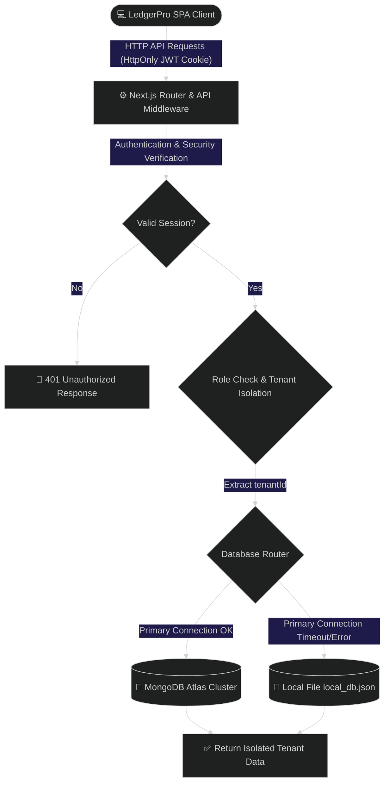

<div align="center">

# 💼 LedgerPro (SaaS Edition)
### *The Premium, Secure, Multi-Tenant Ledger Workspace for Modern Enterprise*

[](https://github.com/jainhardik06/ledgerpro)
[](https://github.com/jainhardik06/ledgerpro)
[](https://github.com/jainhardik06/ledgerpro)
[](https://github.com/jainhardik06/ledgerpro)
[](https://github.com/jainhardik06/ledgerpro)

<br>

<p align="center">
  <a href="#-features">Key Features</a> •
  <a href="#%EF%B8%8F-architecture">System Architecture</a> •
  <a href="#-tech-stack">Tech Stack</a> •
  <a href="#-installation">Getting Started</a> •
  <a href="#-security">Security</a>
</p>

---

</div>

## 🌌 The LedgerPro Concept
LedgerPro transforms accounting from a simple chore into an **audit-proof, high-resiliency multi-tenant SaaS financial command center**. Built upon React 19, Next.js 16 (App Router), and Tailwind CSS v4, LedgerPro guarantees continuous uptime, complete data isolation between organizations, and cryptographic account integrity.

> **Why LedgerPro?** Traditional trackers mix data or require separate deployments for different organizations. LedgerPro is built as a complete SaaS solution featuring strict Data Isolation by `tenantId`, role-based access control (RBAC), and immutable audit logging.

---

## ✨ Features

<div style="display: grid; grid-template-columns: 1fr 1fr; gap: 15px; margin: 20px 0;">
  <div style="border: 1px solid #38b2ac30; padding: 15px; border-radius: 12px; background: rgba(56, 178, 172, 0.05);">
    <h3>🏢 Multi-Tenant Architecture</h3>
    <p>A true SaaS solution. A Super Admin creates completely isolated Organizations (Tenants) and provisions Tenant Admins. Data never leaks across boundaries.</p>
  </div>
  <div style="border: 1px solid #6366f130; padding: 15px; border-radius: 12px; background: rgba(99, 102, 241, 0.05);">
    <h3>🔒 Immutable Audit System</h3>
    <p>Every login, transaction modification, and category update creates an un-deletable log entry tied to the active user session and their specific tenant.</p>
  </div>
  <div style="border: 1px solid #ec489930; padding: 15px; border-radius: 12px; background: rgba(236, 72, 153, 0.05);">
    <h3>👥 Role-Based Access Control</h3>
    <p>Hierarchical access model: Super Admin (Global Management) > Tenant Admin (Organization Management) > User (Ledger Operations).</p>
  </div>
  <div style="border: 1px solid #eab30830; padding: 15px; border-radius: 12px; background: rgba(234, 179, 8, 0.05);">
    <h3>💾 Zero-Downtime Adaptability</h3>
    <p>Automatically routes traffic to a local filesystem JSON database if your primary MongoDB Atlas cluster goes offline.</p>
  </div>
</div>

---

## ⚙️ Architecture

LedgerPro enforces strict data separation logic before hitting the database adapter.



---

## 🛠️ Tech Stack

```text
  🧠 React 19 Engine  ━━━► ⚡ Next.js 16 (App Router) ━━━► 🛡️ JWT & BCrypt Security
                                                               ┃
  📊 SheetJS Exports  ◄━━━  🍃 Native MongoDB Driver  ◄━━━━━━━━┛
```

* **Client**: React 19, Next.js 16 (App Router), Lucide React
* **Styling**: Tailwind CSS v4, custom glassmorphism, responsive grid layout
* **Persistence**: MongoDB Native Driver, Node File System (`fs`) adapter
* **Authentication**: Signed HTTP-Only session cookies (HMAC SHA-256)
* **Encryption**: BCrypt password hashing (10 salt rounds)
* **Serialization**: SheetJS (`xlsx`) spreadsheet engine

---

## 🔒 Security

LedgerPro mitigates modern security risks using these strategies:

| Threat Vector | Security Strategy | Implementation Detail |
| :--- | :--- | :--- |
| **Data Leakage** | Tenant ID Isolation | Every DB query explicitly requires and filters by `tenantId`. Users absolutely cannot query outside their organization. |
| **XSS & Cookie Stealing** | Token Confidentiality | Session JWTs are saved inside `HttpOnly` cookies, preventing client JavaScript access. |
| **Cross-Origin CSRF** | Domain Locking | Session cookies carry `SameSite=Strict`, blocking unauthorized cross-origin requests. |
| **Database Tampering** | Immutable Audit Trail | Audit logs have no update (PUT) or delete (DELETE) routes, establishing a permanent log. |
| **Credential Harvesting** | Admin-Only Onboarding | Public user self-registration is closed. Super Admins invite Tenant Admins, who in turn invite Users. |
| **Password Theft** | Cryptographic Hashing | Client passwords are salted and hashed using `bcryptjs` before storage. |

---

## 🏁 Getting Started

### Prerequisites
- Node.js v18.0.0+
- NPM v9.0.0+
- Optional: MongoDB Atlas cluster URI

### 1. Installation
Clone the repository and install dependencies:
```bash
git clone https://github.com/jainhardik06/ledgerpro.git
cd ledgerpro
npm install
```

### 2. Configuration
Create a `.env.local` file in the project root. **The Super Admin account is strictly managed via environment variables for highest security.**
```env
# MongoDB Connection String (leave blank to use Local File fallback)
MONGODB_URI=mongodb+srv://<username>:<password>@cluster.mongodb.net/ledger_db

# SHA-256 HMAC Secret Key for Signing Cookies
JWT_SECRET=generatetodaysupersecretrandomkeyvaluehere

# Application URL
NEXT_PUBLIC_APP_URL=http://localhost:3000

# Super Admin Dashboard Credentials (No DB lookup required)
SUPER_ADMIN_USERNAME=admin
SUPER_ADMIN_PASSWORD=supersecurepassword
```

### 3. Spin Up Workspace
Run in development mode:
```bash
npm run dev
```
Open [http://localhost:3000](http://localhost:3000) to access the application.

To compile the optimized production bundle:
```bash
npm run build
npm run start
```

---

## 🔑 Initial Setup Flow

1. Log in with your **Super Admin** credentials (from `.env.local`).
2. You will be routed to the Super Admin Dashboard.
3. Click "Add Tenant" to create your first Organization and its primary Tenant Admin.
4. Log out and log back in as the new Tenant Admin to access the Organization and invite internal users.

---

## 📦 System Schema Definitions

<details>
<summary><b>📐 Show Database Interfaces</b></summary>

### 1. Tenant Interface
```typescript
interface Tenant {
  id?: string;
  _id?: any;
  name: string;
  createdAt: Date;
}
```

### 2. User Interface
```typescript
interface User {
  id?: string;
  _id?: any;
  username: string;
  passwordHash: string;
  role: 'TENANT_ADMIN' | 'USER';
  tenantId: string;
  createdAt: Date;
}
```

### 3. Transaction Interface
```typescript
interface Transaction {
  id?: string;
  _id?: any;
  tenantId: string;
  userId: string;
  type: 'Credit' | 'Debit';
  description: string;
  amount: number;
  date: string; // YYYY-MM-DD
  category?: string;
  createdAt: Date;
}
```

### 4. Category Interface
```typescript
interface Category {
  id?: string;
  _id?: any;
  tenantId: string;
  userId: string;
  name: string;
  createdAt: Date;
}
```

### 5. System Activity Log Interface
```typescript
interface SystemLog {
  id?: string;
  _id?: any;
  tenantId?: string;
  username: string;
  action: string;
  details: string;
  timestamp: Date;
}
```
</details>

<details>
<summary><b>📂 Show Directory Layout</b></summary>

```text
ledger/
├── src/
│   ├── app/
│   │   ├── api/
│   │   │   ├── auth/
│   │   │   │   ├── login/route.ts        # Authenticates SuperAdmin & Users
│   │   │   │   ├── logout/route.ts       # Deletes session cookie
│   │   │   │   └── me/route.ts           # Checks session and returns active role
│   │   │   ├── super-admin/
│   │   │   │   └── tenants/route.ts      # Super Admin route to create organizations
│   │   │   ├── tenant/
│   │   │   │   └── users/route.ts        # Tenant Admin route to manage isolated users
│   │   │   ├── categories/
│   │   │   │   ├── route.ts              # GET list / POST custom categories (isolated)
│   │   │   │   └── [id]/route.ts         # DELETE custom category
│   │   │   ├── dashboard/route.ts        # Computes isolated tenant statistics
│   │   │   ├── logs/route.ts             # Retrieves audit trail logs
│   │   │   └── transactions/
│   │   │       ├── route.ts              # GET list / POST transactions (isolated)
│   │   │       └── [id]/route.ts         # PUT updates / DELETE transactions
│   │   ├── globals.css                   # Custom global animations & Tailwind config
│   │   ├── layout.tsx                    # SEO headers, font assets, and layout wrappers
│   │   └── page.tsx                      # Dashboard Orchestrator based on User Role
│   ├── components/
│   │   ├── SuperAdminDashboard.tsx       # Global organization management view
│   │   └── TenantUsersManager.tsx        # Localized user management for Tenant Admins
│   ├── data/
│   │   └── local_db.json                 # local JSON DB file fallback
│   └── lib/
│       ├── auth.ts                       # JWT helper library
│       └── db.ts                         # Resilient DB connection & Multi-Tenant logic
```
</details>
