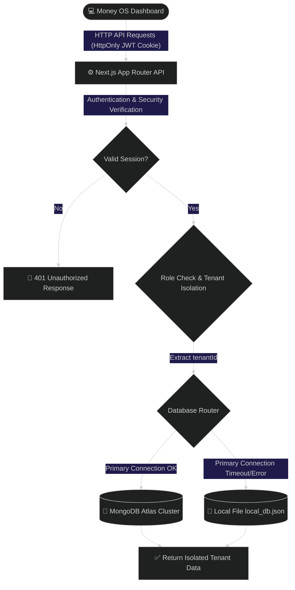

<div align="center">

# 💼 Money OS (LedgerPro SaaS Edition)
### *The Premium, Zero-Cost Financial Command Center for Modern Teams*

[](https://github.com/jainhardik06/ledgerpro)
[](https://github.com/jainhardik06/ledgerpro)
[](https://github.com/jainhardik06/ledgerpro)
[](https://github.com/jainhardik06/ledgerpro)
[](https://github.com/jainhardik06/ledgerpro)

<br>

<p align="center">
  <a href="#-the-money-os-concept">Concept</a> •
  <a href="#-features">Key Features</a> •
  <a href="#%EF%B8%8F-architecture">System Architecture</a> •
  <a href="#-tech-stack">Tech Stack</a> •
  <a href="#-installation">Getting Started</a> •
  <a href="#-security">Security</a>
</p>

---

</div>

## 🌌 The Money OS Concept
Most people don't want an accounting software—they want answers. "How much money do I have?", "Where did it go?", and "Am I profitable?". **Money OS** answers these instantly.

Money OS transforms accounting from a simple chore into an **audit-proof, high-resiliency multi-tenant SaaS financial command center**. Completely re-architected on **Next.js App Router** with an obsession for premium aesthetics (Emil Kowalski / Linear inspired), it features dynamic application modes (Standard, Student Club, Agency), slide-over Drawers, universal Command Palette navigation, and complete multi-tenant data isolation.

It is designed specifically for **Small Businesses, Freelancers, Student Clubs, and Agencies** who need enterprise-grade tracking at **$0 operational cost**.

---

## ✨ Features

<div style="display: grid; grid-template-columns: 1fr 1fr; gap: 15px; margin: 20px 0;">
  <div style="border: 1px solid #38b2ac30; padding: 15px; border-radius: 12px; background: rgba(56, 178, 172, 0.05);">
    <h3>📊 Premium Glassmorphism Dashboard</h3>
    <p>A beautifully designed, premium UI featuring real-time Cash Flow charts, Top Spending breakdowns, and rich metric cards powered by Recharts, encased in subtle gradients and floating elements.</p>
  </div>
  <div style="border: 1px solid #6366f130; padding: 15px; border-radius: 12px; background: rgba(99, 102, 241, 0.05);">
    <h3>⌨️ Universal Command Palette</h3>
    <p>Hit Cmd+K from anywhere in the application to instantly search, navigate, and take actions. Full keyboard navigation built natively into the core layout.</p>
  </div>
  <div style="border: 1px solid #ec489930; padding: 15px; border-radius: 12px; background: rgba(236, 72, 153, 0.05);">
    <h3>🔄 Zero-Cost Recurring Engine</h3>
    <p>Automate your fixed expenses. Uses a brilliant "Login-Evaluated Trigger" system to back-post missed transactions seamlessly without paying for a 24/7 backend cron server.</p>
  </div>
  <div style="border: 1px solid #eab30830; padding: 15px; border-radius: 12px; background: rgba(234, 179, 8, 0.05);">
    <h3>🏢 Multi-Tenant & Self-Serve Onboarding</h3>
    <p>A true SaaS solution. Users can autonomously sign up and instantly provision their own isolated Tenant. Organizations can toggle their "App Mode" to instantly switch terminology (e.g., Student Club mode).</p>
  </div>
  <div style="border: 1px solid #8b5cf630; padding: 15px; border-radius: 12px; background: rgba(139, 92, 246, 0.05);">
    <h3>🔒 Immutable Audit System</h3>
    <p>Every login, transaction modification, and category update creates an un-deletable log entry tied to the active user session and their specific tenant. Viewable inside the Audit Center.</p>
  </div>
  <div style="border: 1px solid #f43f5e30; padding: 15px; border-radius: 12px; background: rgba(244, 63, 94, 0.05);">
    <h3>👥 Role-Based Access Control</h3>
    <p>Hierarchical access model: Super Admin (Global Mission Control) > Tenant Admin (Organization Management) > User (Ledger Operations). Usernames are strictly guaranteed to be globally unique.</p>
  </div>
</div>

### More Superpowers
* **Edge-to-Edge Drawers**: Say goodbye to clunky center modals. All data entry is handled via smooth right-side sliding Drawers.
* **Accounts Abstraction**: Track money across Bank, Cash, UPI, Paytm, and Petty Cash individually.
* **Smart Pre-Seeding**: New organizations are automatically initialized with Core Accounts and Smart Categories.
* **Zero-Cost Receipts**: Attach Google Drive links or receipt notes directly to transactions to avoid expensive S3 bucket hosting.
* **Team Leaderboards**: Track exactly who spent what within an organization.
* **Dynamic Intelligence**: Actively forecasts upcoming cash flow obligations and alerts you before they hit.

---

## ⚙️ Architecture

Money OS enforces strict data separation logic before hitting the database adapter, now operating entirely on Next.js App Router.



---

## 🛠️ Tech Stack

```text
  🧠 React 19 Engine  ━━━► ⚡ Next.js 16 (App Router) ━━━► 🛡️ JWT & BCrypt Security
                                                               ┃
  📊 SheetJS Exports  ◄━━━  🍃 Native MongoDB Driver  ◄━━━━━━━━┛
```

* **Client**: React 19, Next.js 16 (App Router), Lucide React
* **Data Visualization**: Recharts, d3-color
* **Styling**: Tailwind CSS v4, custom glassmorphism, responsive grid layout
* **Persistence**: MongoDB Native Driver, Node File System (`fs`) adapter
* **Authentication**: Signed HTTP-Only session cookies (HMAC SHA-256)
* **Encryption**: BCrypt password hashing (10 salt rounds)

---

## 🔒 Security

Money OS mitigates modern security risks using these strategies:

| Threat Vector | Security Strategy | Implementation Detail |
| :--- | :--- | :--- |
| **Data Leakage** | Tenant ID Isolation | Every DB query explicitly requires and filters by `tenantId`. Users absolutely cannot query outside their organization. |
| **BSON Exceptions** | Safe Object Mapping | All API endpoints use resilient `safeObjectId` wrappers to prevent invalid ID inputs from crashing the node environment. |
| **XSS & Cookie Stealing** | Token Confidentiality | Session JWTs are saved inside `HttpOnly` cookies, preventing client JavaScript access. |
| **Cross-Origin CSRF** | Domain Locking | Session cookies carry `SameSite=Strict`, blocking unauthorized cross-origin requests. |
| **Database Tampering** | Immutable Audit Trail | Audit logs have no update (PUT) or delete (DELETE) routes, establishing a permanent log. |
| **Password Theft** | Cryptographic Hashing | Client passwords are salted and hashed using `bcryptjs` before storage. |

---

## 🏁 Getting Started

### Prerequisites
- Node.js v18.0.0+
- NPM v9.0.0+
- Optional: MongoDB Atlas cluster URI

### 1. Installation
Clone the repository and install dependencies:
```bash
git clone https://github.com/jainhardik06/ledgerpro.git
cd ledgerpro
npm install
```

### 2. Configuration
Create a `.env.local` file in the project root. **The Super Admin account is strictly managed via environment variables for highest security.**
```env
# MongoDB Connection String (leave blank to use Local File fallback)
MONGODB_URI=mongodb+srv://<username>:<password>@cluster.mongodb.net/ledger_db

# SHA-256 HMAC Secret Key for Signing Cookies
JWT_SECRET=generatetodaysupersecretrandomkeyvaluehere

# Application URL
NEXT_PUBLIC_APP_URL=http://localhost:3000

# Super Admin Dashboard Credentials (No DB lookup required)
SUPER_ADMIN_USERNAME=admin
SUPER_ADMIN_PASSWORD=supersecurepassword
```

### 3. Spin Up Workspace
Run in development mode:
```bash
npm run dev
```
Open [http://localhost:3000](http://localhost:3000) to access the application.

To compile the optimized production bundle:
```bash
npm run build
npm run start
```

---

## 🔑 Initial Setup Flow

### Option A: Self-Serve Registration
1. Navigate to the Login screen.
2. Click **"Don't have an account? Sign up"**.
3. Create your Organization, and the backend will automatically pre-seed your accounts and log you into your new isolated Money OS instance.

### Option B: Super Admin Deployment
1. Log in with your **Super Admin** credentials (from `.env.local`).
2. You will be routed to the Global Super Admin Mission Control `/super-admin`.
3. Click "Provision Organization" to forcefully provision a new Organization and its primary Tenant Admin.
4. Distribute the generated credentials to the client.

### Next Steps (For Tenant Admins)
* In the **Settings Center**, configure your **App Mode** (Standard, Student Club, or Agency) to dynamically update terminology.
* In the **Accounts Center**, add more asset Accounts (e.g., Paytm, Petty Cash).
* In the **Team Workspace**, securely invite internal users.

---

## 📦 System Schema Definitions

<details>
<summary><b>📐 Show Database Interfaces</b></summary>

### 1. Tenant Interface
```typescript
interface Tenant {
  id?: string;
  _id?: any;
  name: string;
  appMode?: 'Standard' | 'Student_Club' | 'Agency';
  createdAt: Date;
}
```

### 2. User Interface
```typescript
interface User {
  id?: string;
  _id?: any;
  username: string;
  passwordHash: string;
  role: 'TENANT_ADMIN' | 'USER';
  tenantId: string;
  createdAt: Date;
}
```

### 3. Transaction Interface
```typescript
interface Transaction {
  id?: string;
  _id?: any;
  tenantId: string;
  userId: string;
  type: 'Credit' | 'Debit';
  description: string;
  amount: number;
  date: string; // YYYY-MM-DD
  category?: string;
  accountId?: string;
  clientId?: string;
  notes?: string;
  createdAt: Date;
}
```

### 4. Category, Account & Client Interfaces
```typescript
interface Category {
  id?: string;
  tenantId: string;
  name: string;
}

interface Account {
  id?: string;
  tenantId: string;
  name: string;
  initialBalance: number;
}

interface Client {
  id?: string;
  tenantId: string;
  name: string;
  email?: string;
}
```

### 5. Budget & Recurring Interfaces
```typescript
interface Budget {
  id?: string;
  tenantId: string;
  category: string;
  limitAmount: number;
  month: string; // YYYY-MM
}

interface RecurringTransaction {
  id?: string;
  tenantId: string;
  accountId: string;
  type: 'Credit' | 'Debit';
  description: string;
  amount: number;
  interval: 'Daily' | 'Weekly' | 'Monthly';
  nextRunDate: string; // YYYY-MM-DD
}
```

### 6. System Activity Log Interface
```typescript
interface SystemLog {
  id?: string;
  _id?: any;
  tenantId?: string;
  username: string;
  action: string;
  details: string;
  timestamp: Date;
}
```
</details>

<details>
<summary><b>📂 Show Directory Layout (Next.js App Router)</b></summary>

```text
ledger/
├── src/
│   ├── app/
│   │   ├── api/
│   │   │   ├── auth/                 # Auth Gateway
│   │   │   ├── super-admin/          # Super Admin API Routes
│   │   │   ├── tenant/               # Organization API Routes
│   │   │   ├── transactions/         # Live ledger API
│   │   │   ├── accounts/             # Bank/Asset endpoints
│   │   │   ├── budgets/              # Limit controls
│   │   │   ├── recurring/            # Zero-cost cron logic
│   │   │   ├── clients/              # CRM API
│   │   │   ├── settings/             # Dynamic app state
│   │   │   └── logs/                 # Immutable audit trail
│   │   │
│   │   ├── dashboard/                # Main Post-Login Experience
│   │   │   ├── layout.tsx            # Nested sidebar + context provider
│   │   │   ├── page.tsx              # Command Center Snapshot
│   │   │   ├── transactions/         # Data table & Drawer
│   │   │   ├── accounts/             # Visual account tracking
│   │   │   ├── budgets/              # Progress bars & limits
│   │   │   ├── recurring/            # Obligations tracker
│   │   │   ├── clients/              # Directory
│   │   │   ├── reports/              # Advanced charts
│   │   │   ├── team/                 # RBAC directory
│   │   │   ├── audit/                # Log viewing
│   │   │   └── settings/             # Tenant global settings
│   │   │
│   │   └── super-admin/              # Super Admin Global Experience
│   │       ├── layout.tsx            # Global admin layout
│   │       ├── page.tsx              # Mission Control Dashboard
│   │       ├── tenants/              # Tenant provisioner
│   │       ├── usage/                # Global resource consumption
│   │       └── ...
│   │
│   ├── components/
│   │   ├── ui/                       # Reusable primitives
│   │   │   ├── Drawer.tsx            # Slide-over overlay
│   │   │   └── CommandPalette.tsx    # Cmd+K fuzzy search navigator
│   │   └── dashboard/
│   │       └── DashboardProvider.tsx # Global state orchestrator
│   │
│   └── lib/
│       ├── auth.ts                   # JWT & Encryption
│       └── db.ts                     # MongoDB + Fallback File DB
```
</details>
