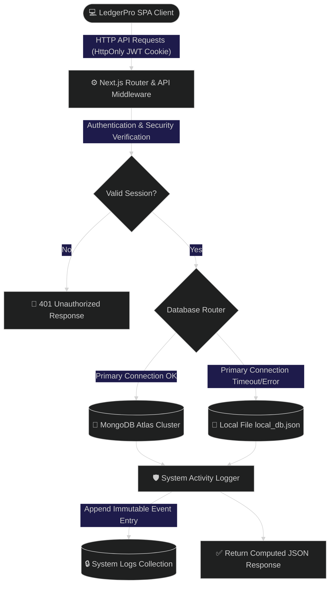

<div align="center">

# 💼 LedgerPro
### *The Premium, Secure & Immutable Ledger Workspace for Modern Enterprise*

[](https://github.com/jainhardik06/ledgerpro)
[](https://github.com/jainhardik06/ledgerpro)
[](https://github.com/jainhardik06/ledgerpro)
[](https://github.com/jainhardik06/ledgerpro)

<br>

<p align="center">
  <a href="#-features">Key Features</a> •
  <a href="#%EF%B8%8F-architecture">System Architecture</a> •
  <a href="#-tech-stack">Tech Stack</a> •
  <a href="#-installation">Getting Started</a> •
  <a href="#-security">Security</a>
</p>

---

</div>

## 🌌 The LedgerPro Concept
LedgerPro transforms accounting from a simple chore into an **audit-proof, high-resiliency financial command center**. Built upon React 19, Next.js 16 (App Router), and Tailwind CSS v4, LedgerPro guarantees continuous uptime, complete transparency, and cryptographic account integrity.

> **Why LedgerPro?** Traditional trackers lose data when databases disconnect, allow users to forge histories, and lack structured audit trails. LedgerPro addresses these weaknesses by implementing dual-database adapters, categorizations, and immutable logging.

---

## ✨ Features

<div style="display: grid; grid-template-columns: 1fr 1fr; gap: 15px; margin: 20px 0;">
  <div style="border: 1px solid #38b2ac30; padding: 15px; border-radius: 12px; background: rgba(56, 178, 172, 0.05);">
    <h3>💾 Zero-Downtime Adaptability</h3>
    <p>Never lose a record. Automatically routes traffic to a local filesystem JSON database if your primary MongoDB Atlas cluster goes offline.</p>
  </div>
  <div style="border: 1px solid #6366f130; padding: 15px; border-radius: 12px; background: rgba(99, 102, 241, 0.05);">
    <h3>🔒 Immutable Audit System</h3>
    <p>Every login, transaction modification, and category update creates an un-deletable log entry tied to the active user session. Immutable by design.</p>
  </div>
  <div style="border: 1px solid #ec489930; padding: 15px; border-radius: 12px; background: rgba(236, 72, 153, 0.05);">
    <h3>🏷️ Smart Categorization</h3>
    <p>Organize records under dynamic categories (Salary, Rent, Food, Utilities, Sales, Investment) with a built-in Category Manager to create/remove options.</p>
  </div>
  <div style="border: 1px solid #eab30830; padding: 15px; border-radius: 12px; background: rgba(234, 179, 8, 0.05);">
    <h3>📊 Interactive Analytics</h3>
    <p>Query operations instantaneously by text, category tags, credit/debit types, and date ranges (Today, Week, Month, Custom Range).</p>
  </div>
</div>

---

## ⚙️ Architecture

LedgerPro relies on a secure routing architecture designed to protect ledger operations.



---

## 🛠️ Tech Stack

```text
  🧠 React 19 Engine  ━━━► ⚡ Next.js 16 (App Router) ━━━► 🛡️ JWT & BCrypt Security
                                                              ┃
  📊 SheetJS Exports  ◄━━━  🍃 Native MongoDB Driver  ◄━━━━━━━━┛
```

* **Client**: React 19, Next.js 16 (App Router), Lucide React
* **Styling**: Tailwind CSS v4, custom glassmorphism, responsive grid layout
* **Persistence**: MongoDB Native Driver, Node File System (`fs`) adapter
* **Authentication**: Signed HTTP-Only session cookies (HMAC SHA-256)
* **Encryption**: BCrypt password hashing (10 salt rounds)
* **Serialization**: SheetJS (`xlsx`) spreadsheet engine

---

## 🔒 Security

LedgerPro mitigates modern security risks using these strategies:

| Threat Vector | Security Strategy | Implementation Detail |
| :--- | :--- | :--- |
| **XSS & Cookie Stealing** | Token Confidentiality | Session JWTs are saved inside `HttpOnly` cookies, preventing client JavaScript access. |
| **Cross-Origin CSRF** | Domain Locking | Session cookies carry `SameSite=Strict`, blocking unauthorized cross-origin requests. |
| **Database Tampering** | Immutable Audit Trail | Audit logs have no update (PUT) or delete (DELETE) routes, establishing a permanent log. |
| **Credential Harvesting** | Admin-Only Onboarding | Public user self-registration is closed. Administrators invite new members securely. |
| **Password Theft** | Cryptographic Hashing | Client passwords are salted and hashed using `bcryptjs` before storage. |

---

## 🏁 Getting Started

### Prerequisites
- Node.js v18.0.0+
- NPM v9.0.0+
- Optional: MongoDB Atlas cluster URI

### 1. Installation
Clone the repository and install dependencies:
```bash
git clone https://github.com/jainhardik06/ledgerpro.git
cd ledgerpro
npm install
```

### 2. Configuration
Create a `.env.local` file in the project root:
```env
# MongoDB Connection String (leave blank to use Local File fallback)
MONGODB_URI=mongodb+srv://<username>:<password>@cluster.mongodb.net/ledger_db

# SHA-256 HMAC Secret Key for Signing Cookies
JWT_SECRET=generatetodaysupersecretrandomkeyvaluehere

# Application URL
NEXT_PUBLIC_APP_URL=http://localhost:3000
```

### 3. Spin Up Workspace
Run in development mode:
```bash
npm run dev
```
Open [http://localhost:3000](http://localhost:3000) to access the dashboard.

To compile the optimized production bundle:
```bash
npm run build
npm run start
```

---

## 🔑 Default Credentials
During the initial initialization, LedgerPro seeds the database with default administrator credentials so you can log in immediately:
- **Username**: `hardik`
- **Password**: `password`

---

## 📦 System Schema Definitions

<details>
<summary><b>📐 Show Database Interfaces</b></summary>

### 1. User Interface
```typescript
interface User {
  id?: string;
  _id?: any;
  username: string;
  passwordHash: string;
  createdAt: Date;
}
```

### 2. Transaction Interface
```typescript
interface Transaction {
  id?: string;
  _id?: any;
  userId: string;
  type: 'Credit' | 'Debit';
  description: string;
  amount: number;
  date: string; // YYYY-MM-DD
  category?: string;
  createdAt: Date;
}
```

### 3. Category Interface
```typescript
interface Category {
  id?: string;
  _id?: any;
  userId: string;
  name: string;
  createdAt: Date;
}
```

### 4. System Activity Log Interface
```typescript
interface SystemLog {
  id?: string;
  _id?: any;
  username: string;
  action: string;
  details: string;
  timestamp: Date;
}
```
</details>

<details>
<summary><b>📂 Show Directory Layout</b></summary>

```text
ledger/
├── src/
│   ├── app/
│   │   ├── api/
│   │   │   ├── auth/
│   │   │   │   ├── create-user/route.ts  # Adds authorized users
│   │   │   │   ├── login/route.ts        # Authenticates and sets JWT cookie
│   │   │   │   ├── logout/route.ts       # Deletes session cookie
│   │   │   │   └── me/route.ts           # Checks session validity
│   │   │   ├── categories/
│   │   │   │   ├── route.ts              # GET list / POST new custom categories
│   │   │   │   └── [id]/route.ts         # DELETE custom category
│   │   │   ├── dashboard/route.ts        # Computes credits, debits, and balance totals
│   │   │   ├── logs/route.ts             # Retrieves audit trail logs (GET only)
│   │   │   └── transactions/
│   │   │       ├── route.ts              # GET list / POST transactions
│   │   │       └── [id]/route.ts         # PUT updates / DELETE transactions
│   │   ├── globals.css                   # Custom global animations & Tailwind config
│   │   ├── layout.tsx                    # SEO headers, font assets, and layout wrappers
│   │   └── page.tsx                      # SPA secured ledger client workspace
│   ├── data/
│   │   └── local_db.json                 # local JSON DB file fallback
│   └── lib/
│       ├── auth.ts                       # JWT helper library
│       └── db.ts                         # Resilient DB connection layer
```
</details>
