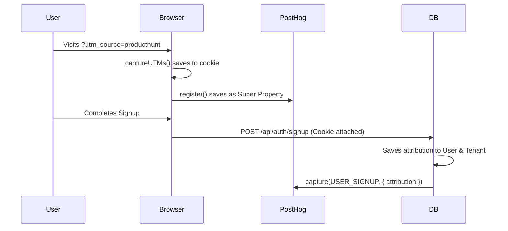

# Money OS UTM Attribution Standards

This document defines the framework for capturing, storing, and analyzing marketing attribution data across the Money OS platform.

## Architecture

1. **Detection**: The `captureUTMs()` function runs on the first client initialization and inspects the URL for any UTM parameters.
2. **Persistence**: Extracted UTM parameters are stored in a first-party cookie (`money_os_utm`) which persists for 90 days.
3. **Propagation**: 
   - On the frontend, UTM data is registered as a `$set_once` Super Property in PostHog, attaching the initial referral source to all subsequent events.
   - On signup, the backend reads the `money_os_utm` cookie and attaches the data permanently to the `User` and `Tenant` records in the database.
   - Backend signup events (`USER_SIGNUP` and `WORKSPACE_CREATED`) include this attribution data.

## UTM Parameters Captured

| Parameter | Description | Example |
| :--- | :--- | :--- |
| `utm_source` | The referrer or source of traffic | `google`, `producthunt`, `newsletter` |
| `utm_medium` | The marketing medium | `cpc`, `email`, `social`, `referral` |
| `utm_campaign` | The specific campaign name | `spring_sale`, `launch_q3` |
| `utm_term` | Search terms (often for paid search) | `finance+software` |
| `utm_content` | Specific ad or link clicked | `hero_banner`, `text_link` |

## Channel Grouping Rules

The `getAttribution()` helper automatically categorizes raw UTM parameters into high-level marketing channels:

| Channel | Detection Logic |
| :--- | :--- |
| **Paid Search** | `utm_medium` matches `cpc`, `ppc`, or `paidsearch` |
| **Organic Search** | `utm_source` is a search engine (`google`, `bing`, `yahoo`) AND `utm_medium` is `organic` |
| **Paid Social** | `utm_medium` matches `paidsocial` OR `utm_source` is a social network with `utm_medium` = `cpc` |
| **Organic Social** | `utm_source` is a social network (`linkedin`, `twitter`, `reddit`, `facebook`) with no paid medium |
| **Email** | `utm_medium` matches `email`, `newsletter` |
| **Referral** | `utm_medium` is `referral` OR `utm_source` is `producthunt`, a directory, etc. |
| **Direct / Unknown** | No UTM parameters present |

## Data Flow Diagram

